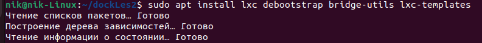
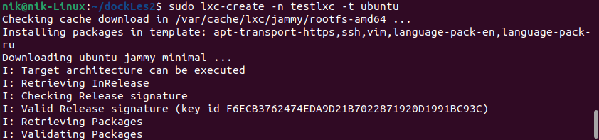
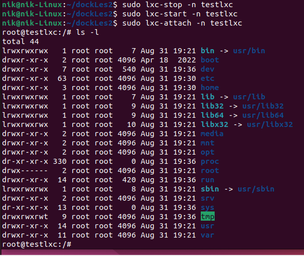
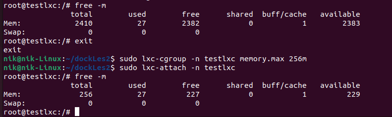

**sudo apt install lxc debootstrap bridge-utils lxc-templates** — установка LXC-конт и 2 доп утилиты (debootstap bridge-utils) для работы LXC-конт и lxc-templates. Как раз в этих темплейтах у нас и хранятся темплейты операционных систем, которые мы можем развернуть.

**sudo lxc-create -n testlxc -t ubuntu** — (указывается имя контейнера с флагом -n - testlxc) и templat на основе которой будет развернута ОС.

Когда контейнер создастся, то его нужно запустить:**sudo lxc-start –n testlxc**
Теперь можем зайти внутрь контейнера: **sudo lxc-attach -n testlxc**
Смотрим, что есть в контейнере: **ls -l**

Смотрим сколько оперативной памяти доступно контейнеру: **free –m**
Выходим в хостовую систему и ограничиваем контейнер 256M оперативной памяти: **sudo lxc-cgroup -n testlxc memory.max 256m**
Возвращаемся в контейнер и проверяем, сколько теперь допустимо оперативной памяти контейнеру: **sudo lxc-attach -n testlxc; free-m**

